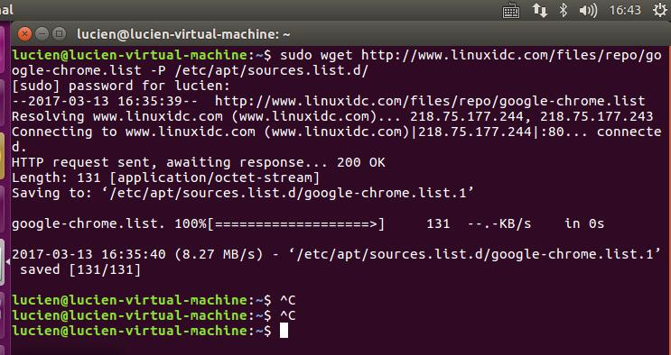

## Linux安装Chrome
#### 1.1 在Linux下启动终端(调出命令行)      
    Ctrl+Alt+T/桌面 -- 右键 -- Open Terminal  
#### 1.2 创建连接,命令行:  
    sudo wget http://www.linuxidc.com/files/repo/google-chrome.list -P /etc/apt/sources.list.d/   
界面显示效果为:  
  
#### 1.3 导入谷歌软件公钥,命令行:  
	wget -q -O - https://dl.google.com/linux/linux_signing_key.pub  | sudo apt-key add -  
#### 1.4 更新系统软件,命令行:  
	sudo apt-get update  
#### 1.5 安装Chrome浏览器  
	sudo apt-get install google-chrome-stable  
#### 1.6 启动Chrome浏览器  
	/usr/bin/google-chrome-stable  
#### 1.7 将Chrome锁定到任务栏  

  
  
  

 

