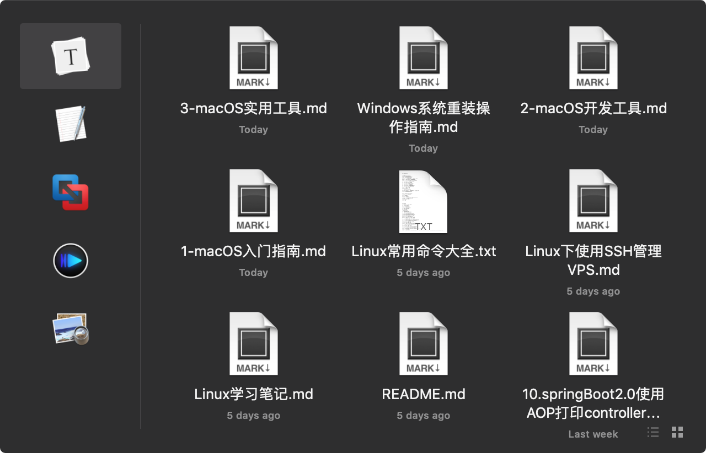
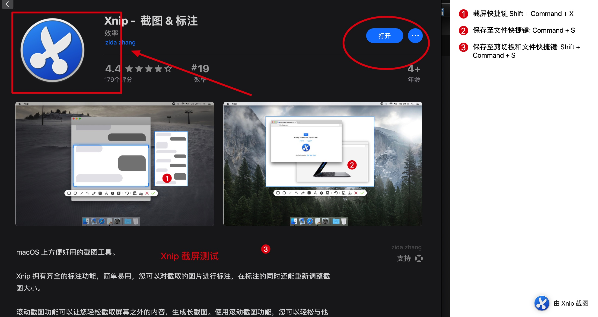
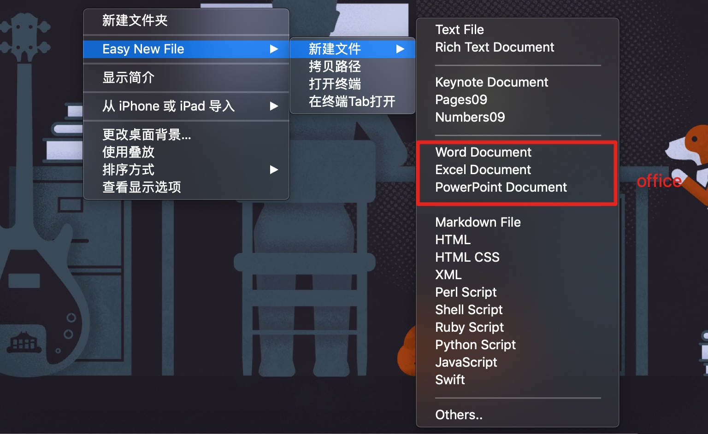
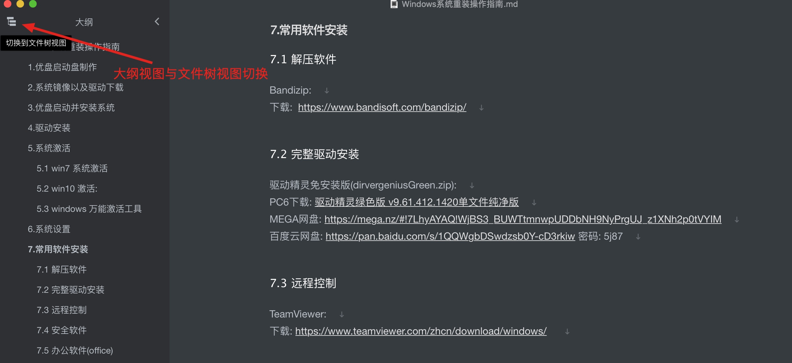
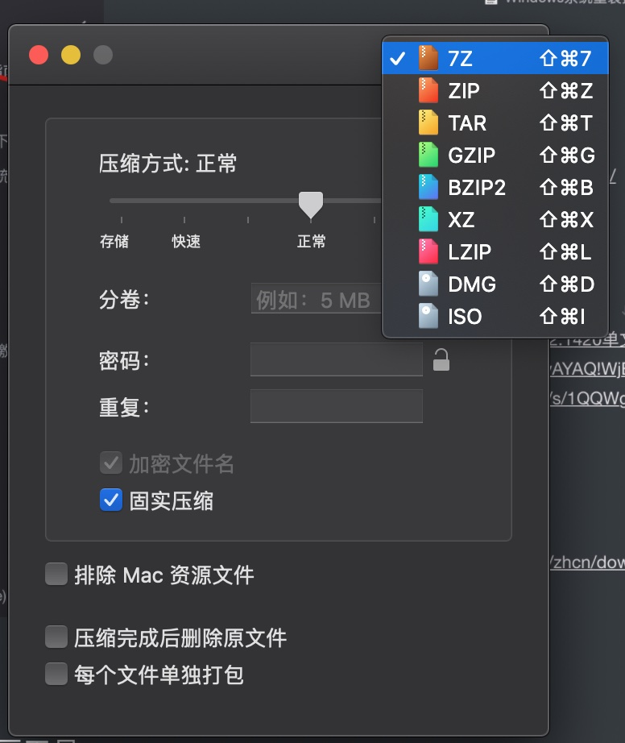
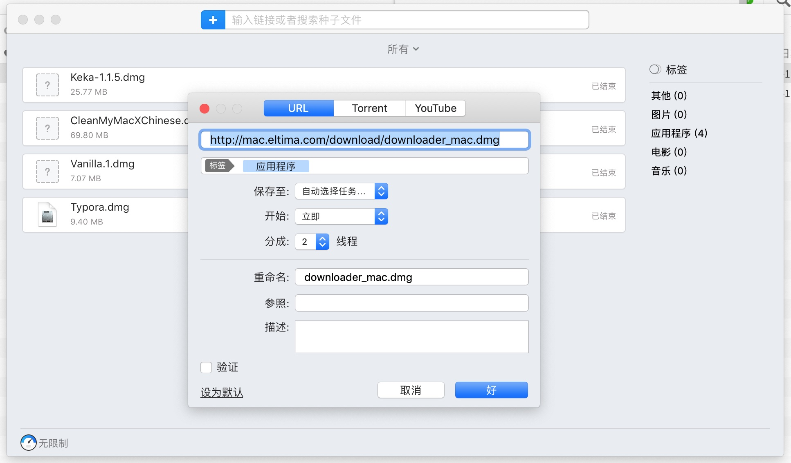
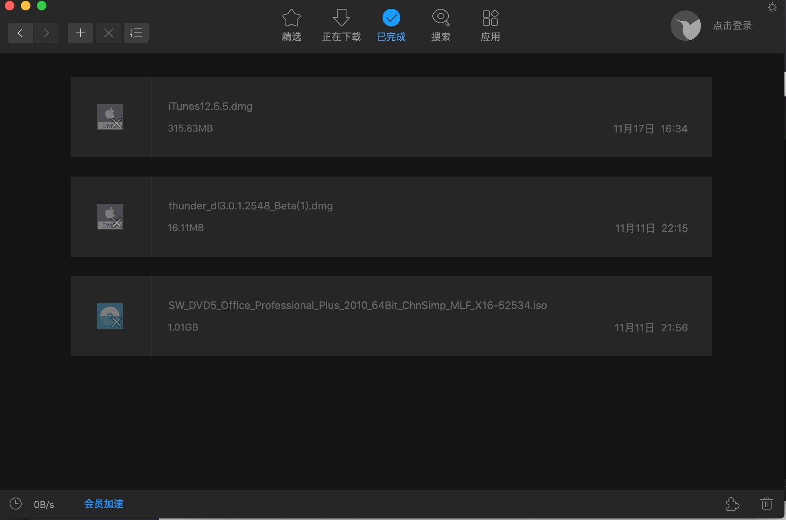
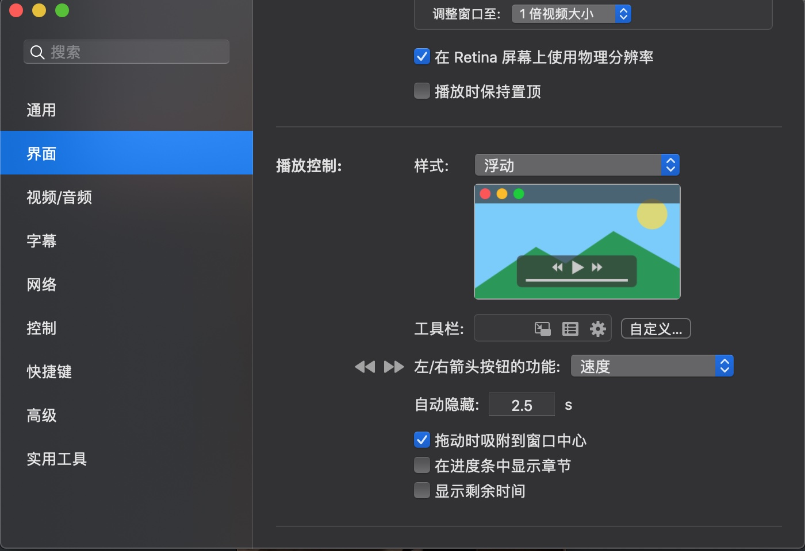

## macOS 实用工具  

​    
​    
​    
### 1 效率工具  

#### 1.1 resents--最近文件  

简介: 用于显示最近常用软件以及最近使用软件的最近文档,目前(2018)免费  

使用技巧: 启动快捷键:`Shift` + `Command` + `Space`(空格),设置: 选中「hide menu bar icon」和「hide dack icon」  

教程: [刚用过的文件就找不到了？试试这款 Mac 启动器：Recents](https://sspai.com/post/43754 "https://sspai.com/post/43754")    

官网下载: [http://recentsapp.com/](http://recentsapp.com/ "http://recentsapp.com/")  

备用下载: [https://mega.nz/#!SHQQGazD!lwzC3zBwFnL11vc0fFAq8Ljonas52LYHWCby-HCKFj4](https://mega.nz/#!SHQQGazD!lwzC3zBwFnL11vc0fFAq8Ljonas52LYHWCby-HCKFj4 "https://mega.nz/#!SHQQGazD!lwzC3zBwFnL11vc0fFAq8Ljonas52LYHWCby-HCKFj4")  

软件截图:  

​    

#### 1.2 Xnip--截图工具  

简介: 截屏工具  

技巧: 截屏快捷键: Shift + Command + X  

教程: [Xnip，支持滚动截长图的 macOS 截图工具](https://sspai.com/post/42686 "https://sspai.com/post/42686")

下载: [https://zh.xnipapp.com/](https://zh.xnipapp.com/ "https://zh.xnipapp.com/")  

截图:  

#### 1.3 Easy New File--右键增强  

简介: macOS 右键增强,可以在 Finder 中右键创建新文件  

教程&下载:  

[Easy New File 4.5 右键增强工具](http://xclient.info/s/easy-new-file.html?t=c027ebf3bece32d6114473476925b27bb3e1c6e2#versions "http://xclient.info/s/easy-new-file.html?t=c027ebf3bece32d6114473476925b27bb3e1c6e2#versions")  

[右键快速新建文件，让Mac像Windows一样！](http://www.macbl.com/article/apps/1461 "http://www.macbl.com/article/apps/1461")  

备用下载: [https://mega.nz/#!Ge5W0SgR!flEedfI43vxamPlZuZoCW1JKpbC3bqJxKeOhUQ6wmOQ](https://mega.nz/#!Ge5W0SgR!flEedfI43vxamPlZuZoCW1JKpbC3bqJxKeOhUQ6wmOQ "https://mega.nz/#!Ge5W0SgR!flEedfI43vxamPlZuZoCW1JKpbC3bqJxKeOhUQ6wmOQ")  

截图:  

#### 1.4 Alfred--搜索  

简介: 一系列高效率系统工具集合,免费版常用功能:本地全局搜索(类似 Spotlight)、网络搜索、系统命令等  

技巧: 本地搜索用「Spotlight」，网络搜索用「Alfred」，Windows 系统类似功能实现: [「Wox」](http://www.wox.one/ "http://www.wox.one/") + [「Everything」](https://www.voidtools.com/ "https://www.voidtools.com/")搭配    

教程: [总是在 Mac 「装机必备」看到的搜索利器 Alfred，究竟是怎么用的？| 新手问号](https://sspai.com/post/43973 "https://sspai.com/post/43973")  

官网下载: [https://www.alfredapp.com/](https://www.alfredapp.com/ "https://www.alfredapp.com/")  

备用下载: [https://mega.nz/#!GfYGVSIJ!sL7QpMydO67tti_wwsSFsky_JlygHAwW2uF7bsxaJaY](https://mega.nz/#!GfYGVSIJ!sL7QpMydO67tti_wwsSFsky_JlygHAwW2uF7bsxaJaY "https://mega.nz/#!GfYGVSIJ!sL7QpMydO67tti_wwsSFsky_JlygHAwW2uF7bsxaJaY")  

截图:   

#### 1.5 Typora--Markdown编辑器  

简介: `Markdown` 编辑器,目前(2018)免费,简洁,好用,全平台支持(Windows/macOS/Linux)  

技巧: 用好文件视图和大纲视图就可以了,其他的不教自会  

官网下载: [https://typora.io/](https://typora.io/ "https://typora.io/")  

备用下载: [https://mega.nz/#!bPRGyayQ!lQ7vXUYmLRW63uSKB5EgywJUr0YeWQcqXwDhkm-7gZQ](https://mega.nz/#!bPRGyayQ!lQ7vXUYmLRW63uSKB5EgywJUr0YeWQcqXwDhkm-7gZQ "https://mega.nz/#!bPRGyayQ!lQ7vXUYmLRW63uSKB5EgywJUr0YeWQcqXwDhkm-7gZQ")  

截图: 

#### 1.6 Keka--解压工具  

简介: 解压工具  

官网下载: [https://www.keka.io/zh-cn/](https://www.keka.io/zh-cn/ "https://www.keka.io/zh-cn/")  

备用下载: [https://mega.nz/#!7OhTAQ7I!G50g52lKP-vb4neGD0FY9hayZdUkvKOB2P5od4WLVs4](https://mega.nz/#!7OhTAQ7I!G50g52lKP-vb4neGD0FY9hayZdUkvKOB2P5od4WLVs4 "https://mega.nz/#!7OhTAQ7I!G50g52lKP-vb4neGD0FY9hayZdUkvKOB2P5od4WLVs4")  

截图:   

### 2 下载工具  

#### 2.1 FOLX--下载工具  

简介: mac 平台老牌下载工具,支持 http 和 种子(Torrent)下载,不支持ed2k链接,免费版已经够用  

官网下载: [https://mac.eltima.com/download-manager.html](https://mac.eltima.com/download-manager.html "https://mac.eltima.com/download-manager.html")  

备用下载: [https://mega.nz/#!HDxEEQDR!t9OuysRV9MssSptKxHtQItZmm6j3Q34wUg_y9jx-l3A](https://mega.nz/#!HDxEEQDR!t9OuysRV9MssSptKxHtQItZmm6j3Q34wUg_y9jx-l3A "https://mega.nz/#!HDxEEQDR!t9OuysRV9MssSptKxHtQItZmm6j3Q34wUg_y9jx-l3A")  

截图:  

#### 2.2 迅雷--下载工具  

简介: 全网最快的下载工具,支持多种协议,但是广告偏多,非会员会有速度限制  

技巧: 迅雷 3.0 系列是比较良心的,无广告,但是功能较弱,可在历史版本中下载;迅雷3.2+ 功能强大,手动改造之后也可以实现无广告  

教程: [手动去除Mac版迅雷无用的功能&插件 做纯粹的下载工具](https://laod.cn/tools/mac-xunlei.html "https://laod.cn/tools/mac-xunlei.html")  

官网下载: [http://mac.xunlei.com//](http://mac.xunlei.com/ "http://mac.xunlei.com/")  

迅雷历史版本下载: [http://mac.xunlei.com/history_version.html](http://mac.xunlei.com/history_version.html "http://mac.xunlei.com/history_version.html")  

迅雷 3.2 备用下载: [https://mega.nz/#!fHpxBIJa!1SnlRr3aJG3hDA_ucI9MITAvzD2Zvk5KfFTxOoglqjU](https://mega.nz/#!fHpxBIJa!1SnlRr3aJG3hDA_ucI9MITAvzD2Zvk5KfFTxOoglqjU "https://mega.nz/#!fHpxBIJa!1SnlRr3aJG3hDA_ucI9MITAvzD2Zvk5KfFTxOoglqjU")  

迅雷 3.0 备用下载: [https://mega.nz/#!jCxXjIBD!g-H6xLq3-V4a94c-d5mp8DrNEMo5gUrDR7_mVnjkcFk](https://mega.nz/#!jCxXjIBD!g-H6xLq3-V4a94c-d5mp8DrNEMo5gUrDR7_mVnjkcFk "https://mega.nz/#!jCxXjIBD!g-H6xLq3-V4a94c-d5mp8DrNEMo5gUrDR7_mVnjkcFk")  

迅雷 3.0 截图:  

### 3 音视频播放  

#### 3.1 网易云音乐--音乐播放器  

简介: 网易云音乐是一款国内优秀的懂你的音乐软件,能够根据个人喜好推荐音乐  

官网下载: [https://music.163.com/](https://music.163.com/ "https://music.163.com/")  

截图:  

### 3.2 iina—视频播放器  

简介: iina 是 Mac 平台的万能视频播放器,开源,免费  

教程: [macOS 上最好的现代视频播放器：IINA](https://sspai.com/post/40870 "https://sspai.com/post/40870")  

使用 `homebrew` 安装 `iina`:  `brew install iina`  

官网下载: [https://lhc70000.github.io/iina/](https://lhc70000.github.io/iina/ "https://lhc70000.github.io/iina/")  

截图:  

