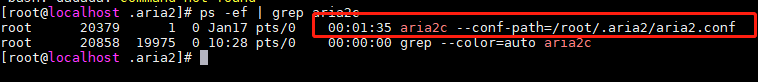
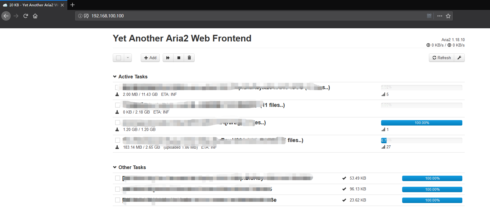

## Linux 安装 aria2c 搭建离线下载服务器  


​    
### 1 摘要    

[aria2c](https://aria2.github.io/ "https://aria2.github.io/") 是一款支持多协议的高速下载工具,支持的协议包括:  **HTTP/HTTPS**, **FTP**, **SFTP**, **BitTorrent** and **Metalink** (不包含 ed2k),软件本身没有 GUI 界面,属于命令行工具,有基于 aria2c 服务适配的第三方 GUI 软件/项目。本文将基于 **centOS 7** 系统安装 aria2c 软件  

​    

### 2 安装  

安装 [EPEL](https://fedoraproject.org/wiki/EPEL "https://fedoraproject.org/wiki/EPEL")  

```bash
yum install -y epel-release
```

安装 [aria2c](https://aria2.github.io/ "https://aria2.github.io/") 客户端  

```bash
yum install -y aria2c
```

执行完以上命令, aria2c 就已经安装好了。

aria2c 命令行的一些使用教程:  

官方教程: [https://aria2.github.io/](https://aria2.github.io/ "https://aria2.github.io/")   

​    

### 3 配置  

由于 aria2c 属于命令行工具,每次运行都需要操作者手动进行参数配置,且下一次运行不会保存上一次的配置信息,因此需要指定固定的配置信息来启动软件/服务  

3.1 创建一个目录,用于存放 aria2c 的配置信息  

```bash
mkdir -p /root/.aria2c/aria2c
```

3.2 创建 aria2c 的配置文件  

```bash
touch /root/.aria2c/aria2c/aria2c.conf
```

3.3 编辑 aria2c 配置文件  

3.3.1 手动编辑  

```bash
vim /root/.aria2c/aria2c/aria2c.conf
```

如果提示 `-bash: vim: command not found` 则表明系统没有安装 `vim` 软件,先安装 `vim`,命令如下: 

```bash
yum install -y vim
```

aria2c 配置信息可参考:  

 [Aria2 & YAAW 使用说明](http://aria2c.com/usage.html "http://aria2c.com/usage.html")  

aria2c 官方文档: [https://aria2.github.io/manual/en/html/](https://aria2.github.io/manual/en/html/ "https://aria2.github.io/manual/en/html/")  

3.3.2 下载 aria2c 模板  

如果不打算手动创建模板,则可以下载作者的模板  

进入 aria2c 配置文件目录  

```bash
cd /root/.aria2c/aria2c
```

下载 `wget` 软件 (如果已经安装 `wget` 命令软件,则不需要再安装)  

```bash
yum install -y wget
```

下载配置文件  

```bash
wget -O aria2c.conf https://raw.githubusercontent.com/Flying9001/Notes/master/Tools/aria2c/aria2c.conf
```

参考文档中的配置信息需要操作者手动改动的地方有:  

```properties
# 文件的保存路径(可使用绝对路径或相对路径), 默认: 当前启动位置
dir=~/downloads
# 从会话文件中读取下载任务
input-file=/etc/aria2/aria2.session
# 在Aria2退出时保存`错误/未完成`的下载任务到会话文件
save-session=/etc/aria2/aria2.session
```

3.4创建会话保存文件  

会话文件,即 `input-file` 与 `save-session` 后边的属性值,该文件用于保存下载会话,从而实现断点续传功能  

```bash
touch /root/.aria2c/aria2c/aria2c.session
```

创建之后,将配置文件中 `input-file` 以及 `save-session` 修改为刚才创建的文件路径,即:   

```bash
input-file=/root/.aria2c/aria2c/aria2c.session 
save-session=/root/.aria2c/aria2c/aria2c.session
```

​    

### 4 启动    

配置完成之后,即可启动 aria2c 服务了  

启动命令  

```bash
nohup aria2c --conf-path=/root/.aria2c/aria2c/aria2c.conf >/dev/null 2>&1 &
```

这一条命令的意思是后台启动 `aria2c` 程序,让 aria2c 服务在后台运行,从而不影响当前用户执行其他命令操作;同时不打印程序运行日志(nohup 后台启动时会默认在当前目录下创建 `nohup.out` 文件用于记录后台程序日志)  

校验是否启动成功  

执行上边的启动命令之后,理论上程序会启动了,但是由于没有 GUI 界面,因此无法直观的感知程序是否启动;这里，可以通过查看进程来确定程序是否运行  

查看 aria2c 进程命令  

```bash
ps -ef | grep aria2c
```

结果演示  



如果输出内容包含红线标注的部分,则表明 aria2c 程序已经启动,否则,就是启动失败  

关于失败的原因,将在后边的注意事项中详细描述  

停止 aria2c 服务  

由于并没有将 aria2c 设置为 Linux 服务,因此如需关闭,只能采用杀死进程的方式  

在上述的查看 aria2c 进程命令中,输出结果的第二列为进程 id(pid)  

杀死 aria2c 对应的进程  

```shell
kill -9 20379    
```

命令执行后仍然可通过查看进程命令来校验 aria2c 是否真的关闭  

​    

### 5 安装 WEB GUI 管理面板  

在上边的介绍中已经提到, aria2c 是一款命令行软件,没有具体的操作界面,为了管理方便,则可以安装 web GUI 管理面板,web 操作面板是需要有 http 服务的,可以使用 Tomcat 提供 web 服务(需要安装 JDK);也可以直接安装 http 服务。为了操作简便,这里采用安装 http 服务的方式  

#### 5.1 安装 http 服务  

```bash
yum install -y httpd
```

http 服务的操作命令  

```bash
## 启动
service httpd start
## 停止
service httpd stop
## 查看运行状态
service httpd status
```

http 服务的默认 开启/访问 端口为 **80** 端口  

http 服务开启之后,即可直接访问  

在浏览器地址栏输入服务器 ip/域名 即可访问,如  

[http://192.168.100.100/](http://192.168.100.100/ "http://192.168.100.100/")  

**该地址为作者用于演示的内网地址,外网无法访问**  

如果访问服务器的 ip时,提示无法连接时,可能是由于防火墙没有开启 **80** 端口导致,将端口开启即可  

**centOS 7** 防火墙开启 **80** 端口  

```bash
firewall-cmd --zone=public --add-port=80/tcp permanent
```

如果觉得从防火墙中逐个端口开放比较麻烦,则可以关闭防火墙(**关闭防火墙意味着服务器将处于没有保护状态,正式环境建议开启**)  

关闭防火墙命令  

```shell
service stop firewalld
service disable firewalld
```

关于 Apache http 服务的一些相关知识  

配置文件路径:   `/etc/httpd/conf/httpd.conf `  

默认下载路径: `/www/http/down`  

默认部署路径: `/var/www/html`  

默认访问端口: **80** 端口  

​    

#### 5.2 安装 aria2c 控制面板服务  

上边提到 http 服务的默认部署路径为 `/var/www/html` ,因此将 web 项目(仅前端页面) 放到该目录下,即可访问  

提供 aria2c 控制面板服务的项目众多,这里比较有名的有:  

**webui-aria2**: [https://github.com/ziahamza/webui-aria2](https://github.com/ziahamza/webui-aria2 "https://github.com/ziahamza/webui-aria2")  

**AriaNg**: [https://github.com/mayswind/AriaNg](https://github.com/mayswind/AriaNg "https://github.com/mayswind/AriaNg")  

**YAAW**: [https://github.com/binux/yaaw](https://github.com/binux/yaaw "https://github.com/binux/yaaw")  

这些项目的功能都是一样的,给 aria2c 提供一个可视化的管理面板  

这里以 **YAAW** 为例  

首先,需要进入 http 服务的部署目录  

```shell
cd /var/www/html
```

下载 **YAAW** 项目代码  

```shell
wget https://github.com/binux/yaaw/archive/master.zip
```

安装解压缩工具 **unzip** (如果已经安装,则跳过此步)  

```shell
yum install -y unzip
```

解压 **YAAW** 项目  

```shell
unzip master.zip
```

解压之后会生成一个 `yaaw-master` 的文件夹  

将 **YAAW** 项目代码移动到部署目录  

```shell
mv yaaw-master/* ./
```

此时, **YAAW** 控制面板已经部署完成,直接访问上边的 http 服务即可看到 **YAAW** 面板  



关于 **YAAW** 的属性设置,可参考:  

[Aria2 & YAAW 使用说明](http://aria2c.com/usage.html "http://aria2c.com/usage.html")  

​    

关于 **YAAW** 的设置说明  

如果在 aria2c 的配置文件中设置了访问密码,则一定要修改 yaaw 的连接配置才可以访问到 aria2c 服务  

如果提示 `Error: Unauthorized ` 则表明没有连接 aria2c 服务的权限,需要在 yaaw 添加认证      

如果提示 `Error: Internal server error `,则表明 aria2c 服务没有启动或者服务异常;重新启动 aria2c 服务即可  

重启之后, aria2c 不会自动继续下载,所有的任务都会停止,需要重新添加下载任务,如果是之前已经添加过的任务,则会接着上次下载的位置继续下载  

通过 yaaw 添加下载任务时会有部分属性可选填  

**File Name** : 下载之后的文件名,默认为下载文件自带的名称,无需修改  

**Dir**: 下载文件保存路径,这里填写的是**绝对路径**,如: `/www/http/down`,默认地址问 aria2c 配置文件中的下载路径    

至此, 一个简易版 aria2c 下载服务已经搭建完成。  

如需进一步完善 aria2c 服务,可参考:  

[Linux平台使用脚本更新aria2c离线下载bt加速服务器](2.Linux平台更新bt加速服务器脚本.md "2.Linux平台更新bt加速服务器脚本.md")   

​    

#### 5.3 安装 aria2c 浏览器插件  

如果不想手动安装 aria2c web GUI 控制面板的话,可以选择直接安装浏览器插件,效果是一样的  

Chrome 浏览器: [Aria2 for Chrome](https://chrome.google.com/webstore/detail/aria2-for-chrome/mpkodccbngfoacfalldjimigbofkhgjn "https://chrome.google.com/webstore/detail/aria2-for-chrome/mpkodccbngfoacfalldjimigbofkhgjn")  

FireFox 浏览器: [Aria2 Download Manager Integration](https://addons.mozilla.org/en-US/firefox/addon/aria2-integration/ "https://addons.mozilla.org/en-US/firefox/addon/aria2-integration/")  

​    

### X 注意事项

- 关于防火墙的设置,centOS 7 以下版本使用 iptables,从 centOS 7 开始使用 firewall-cmd 来设置防火墙  

- 正式环境建议开启防火墙  

- 正式环境建议设置 aria2c 访问密码(`rpc-secret` 属性)  

- 如果Linux 系统中安装有 JDK,则可以使用 Tomcat 部署 web 项目  

- **如果将 aria2c 部署到云端服务器,可能有被封的风险**  

- aria2c 并不是万能的,下载种子的效果并不比迅雷好,很多种子并不能下载  


