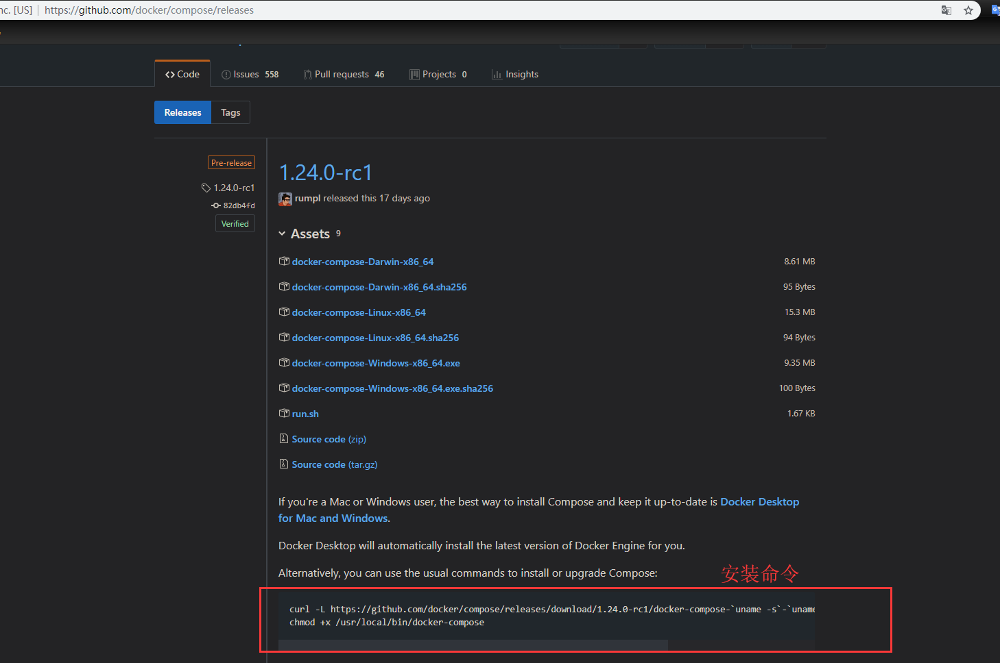

## 使用 docker-compose 安装部署 Wordpress  


​    
​    
### 1 摘要    

docker-compose 是 Docker 官方推荐的多容器管理工具,极大简化 Docker 命令操作,Wordpress 是目前(2019) 全球使用最广泛的个人博客技术框架。本文将介绍如何使用 docker-compose 安装 Wordpress  

Docker compose 官方文档: [https://docs.docker.com/compose/](https://docs.docker.com/compose/ "https://docs.docker.com/compose/")  

​    

### 2 安装步骤  

安装步骤主要参考官方教程  

#### 2.1 安装 docker-compose  

docker-compose 是 Docker 官方维护的容器管理工具,但是并没有直接在 Docker 客户端中打包安装,需要自行安装  

docker-compose 是一个 **二进制文件,可以直接运行(添加执行权限之后)**

docker-compose Gtihub 地址: [https://github.com/docker/compose/releases](https://github.com/docker/compose/releases "https://github.com/docker/compose/releases")  

  

下载 docker-compose   

```shell
curl -L https://github.com/docker/compose/releases/download/1.24.0-rc1/docker-compose-`uname -s`-`uname -m` -o /usr/local/bin/docker-compose
```

给 docker-compose 添加执行权限  

```shell
chmod +x /usr/local/bin/docker-compose
```

